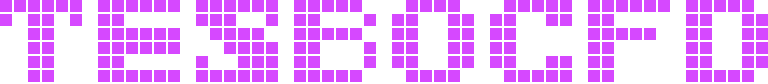
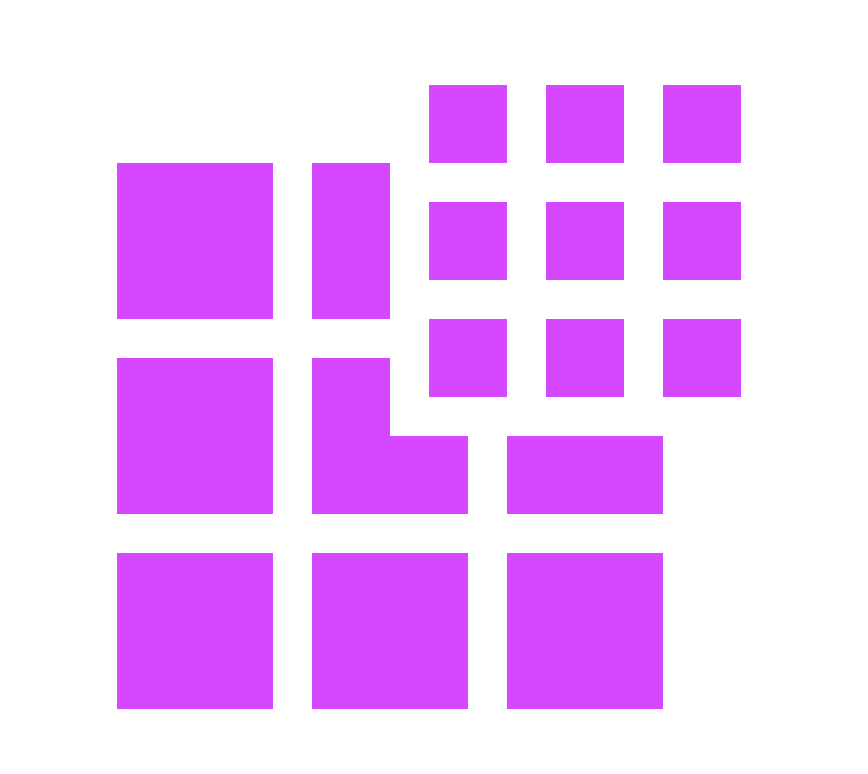

# TesboCFD

### Built for speed. Powered by GPU.

**GPU-native computational fluid dynamics — making high-fidelity simulation go from days to minutes.**

---

## Who we are

**TesboCFD** is a team focused on **GPU-native computational fluid dynamics (CFD)**.
We build modern simulation software that runs the entire pipeline on the GPU —
delivering large speedups over traditional CPU clusters, so engineers spend less
time waiting and more time designing.

> **See it running** — simulation cases, flow-field visuals and more at
> **[tesbocfd.com](https://www.tesbocfd.com/)**.
>
> **Star this repo and follow [TesboCFD on GitHub](https://github.com/Tes-bo)** to track our progress.
>
> **Open to collaboration and investment** — technical partnerships, business partnerships, and investment conversations are all welcome.

---

## Products

| Product | What it is | Status |
|---|---|---|
| **TesboFlow** | Fully GPU-native general-purpose CFD solver | Available, actively developed — **multi-GPU** |
| **TesboLBM** | In-house casting-simulation solver (mold filling + solidification) | Available |
| **TesboAI** | AI + CFD product line (ML surrogates, differentiable physics, agentic CFD) | Prototypes ready, productizing |

 

### TesboFlow — GPU-native CFD solver

Our flagship: a fully GPU-native CFD solver for general-purpose fluid simulation.
The whole pipeline — mesh, discretization, linear algebra, post-processing — runs
on the GPU, with no CPU bottleneck.

- **Available today**: incompressible flow (steady & transient); RANS and LES
  turbulence; scalar transport; energy and **multi-region conjugate heat
  transfer**; moving/deforming meshes and rigid-body motion; overset (chimera)
  grids; periodic boundaries; **multi-GPU execution on a single machine**; and
  import/conversion of external mesh formats. Physics is selected from the case
  configuration — one executable, no separate binary per problem type.
- **Also available**: a **CPU-only build from the same source** (for GPU-less
  environments and independent cross-checking), and a **fully self-developed GPU
  algebraic multigrid**, so TesboFlow can be deployed where third-party solver
  libraries are not an option.
- **In development**: multi-phase flow (VOF free surface), hybrid RANS-LES
  (DES/DDES), and cross-node (cluster) execution — cross-node is the same code
  path as single-machine multi-GPU and is designed for it, but we have not
  validated it on a cluster yet.
- **On the roadmap**: compressible flow, broader platforms (e.g. arm64 and other
  GPU vendors), and a graphical GUI (under consideration, not near-term).

> **Multi-GPU**: one rank per GPU, any number of cards, and the same build runs
> correctly on whatever machine you put it on. Results are **independent of how
> many cards you run on, and reproducible** — the answer you sign off on stays
> the answer.

> **Performance**
> - **Measured**: a single GPU (e.g. a V100) ran about **10× faster than a
>   32-process CPU run** in our tests — and we are still actively optimizing,
>   with substantial room to go.
> - **Target**: **100–1000×** over CPU clusters on typical workloads. This is a
>   target, not a guarantee — actual gains depend on case size and hardware.
>
> We're happy to run a benchmark on your own case.

### TesboLBM — Casting simulation

An in-house casting-simulation suite built on the Lattice Boltzmann Method, for
industrial casting processes and casting-defect analysis. It covers **mold
filling** and **heat transfer / solidification**, with the two stages coupled —
the filling result feeds straight into solidification, so you simulate the
process as it actually happens rather than as two separate problems.

- **Available today**: gravity sand casting; cavity venting and back-pressure;
  natural convection; alloy property data including temperature-dependent
  solidification behaviour; calibration against measured cooling curves;
  comparison of simulation against measurement; and prediction of common casting
  defects. Runs on both CPU and GPU, including multiple GPUs on one machine.
- **In development**: **external flow / external aerodynamics**, extending the
  same GPU-native engine beyond casting; low-pressure casting.

Ships with its own command-line mesh generator and is proven end-to-end on real
production parts.

### TesboAI — AI + CFD

TesboCFD's AI + CFD product line, deeply integrated with TesboFlow. One goal above
all: **AI-assisted CFD design** — greatly accelerating design iteration toward
near-real-time, interactive exploration.

- **Machine learning / deep learning surrogates**: neural operators (FNO-type),
  reduced-order models, implicit neural representations, and data-driven
  turbulence modeling.
- **Physics-informed / differentiable physics**: physics-constrained learning and
  end-to-end differentiable CFD.
- **Agentic CFD**: LLM/agent-driven natural-language CFD workflows — natural
  language in, case set up, solved on our own GPU solver, then checked against
  **mandatory validation gates** before anything is reported. A working
  end-to-end prototype exists today; results that do not pass the gates are
  labelled unvalidated rather than presented as conclusions.

> Several working prototypes and baselines exist today; productization is in
> progress.

---

## Why GPU-native

- **Built for the GPU from the ground up** — not a port of CPU code, so the
  architecture is cleaner and the performance ceiling is higher.
- **Whole pipeline on-device** — no CPU↔GPU data-shuffling overhead.
- **Self-developed full stack** — solver + casting + AI, deeply integrated. This
  goes all the way down: even the algebraic multigrid is ours, so TesboFlow can
  be deployed in environments where third-party solver libraries are not an
  option — and the same source also builds a CPU-only binary.
- **Scalable** — from a single desktop GPU to multiple GPUs in one machine
  today, with cross-node execution on the same code path (pending cluster
  validation).

---

## Validation & correctness

Speed only counts if the answer is right. Every change to the solver is checked
three ways, in parallel:

- **Analytic and manufactured solutions** — channel and duct flows, skewed
  meshes, periodic flows, transient and multi-layer conduction, surface tension
  on a static droplet, hydrostatic balance, subgrid-scale closure.
- **Published benchmarks** — e.g. the Ghia lid-driven cavity.
- **Cross-comparison against an independent, mature CPU solver** — on the same
  mesh and the same settings, including conjugate heat transfer and overset
  turbulent cases.

> Want the details on a specific case? Ask us — we would rather show the
> validation than assert the speed.

---

## What we do

- **CFD software development** — advanced GPU-native solvers and high-performance
  simulation tools.
- **Engineering simulation** — simulation analysis and optimization for complex
  fluid engineering problems.
- **Technical consulting** — numerical modeling and advanced simulation support.
- **Training** — CFD theory, numerical methods, GPU/CUDA, and modern simulation
  courses. See [tesbocfd.com](https://www.tesbocfd.com/).

---

## Development highlights

- **2025** — Fully GPU-native incompressible flow solver.
- **Q1 2026** — Dynamic (moving/deforming) mesh and overset (chimera) grids on GPU.
- **Q2 2026** — **Multi-GPU execution** (one rank per GPU, any number of cards,
  with reproducible, card-count-independent results).
- **Q2 2026** — LES turbulence; scalar transport.
- **Q3 2026** — **Energy equation and multi-region conjugate heat transfer**,
  validated against analytic solutions and cross-checked against an independent
  solver.
- **Q3 2026** — **Fully self-developed GPU algebraic multigrid**, and a
  **CPU-only build from the same source** — no dependence on third-party solver
  libraries, and deployable without a GPU.
- **Q3 2026** — Licensing, delivery packaging, and a one-click runtime support
  bundle for deployed installations.
- **In progress** — Multi-phase flow (VOF free surface), hybrid RANS-LES
  (DES/DDES), and cross-node cluster validation.
- **Next** — Compressible flow, broader hardware platforms, and advanced
  turbulence models.

> TesboFlow is currently under **closed-source development**.

---

## Research collaboration

We collaborate with research institutions on advanced simulation and solver
validation, including Tsinghua University, the Institute of Mechanics (CAS), and
the University of Shanghai for Science and Technology.

---

## Get in touch

- **Evaluate on your own case** — we run a collaborative pilot: you provide a
  representative case, we run it and compare against your existing results.
- **Collaboration & investment** — we welcome technical/business partnerships and
  investment conversations.
- **Contact** — cotsqa@qq.com · https://www.tesbocfd.com/ · https://github.com/Tes-bo

---

**Developed and maintained by the TesboCFD Team**

**Built for speed. Powered by GPU.**

